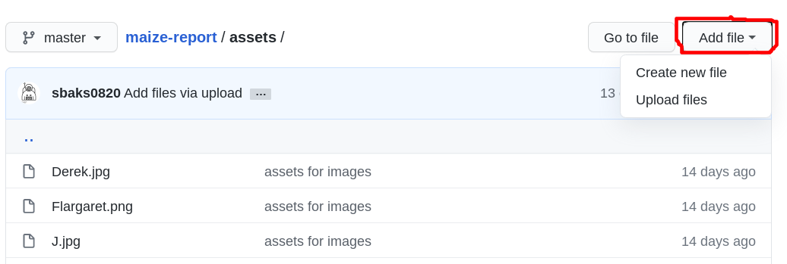
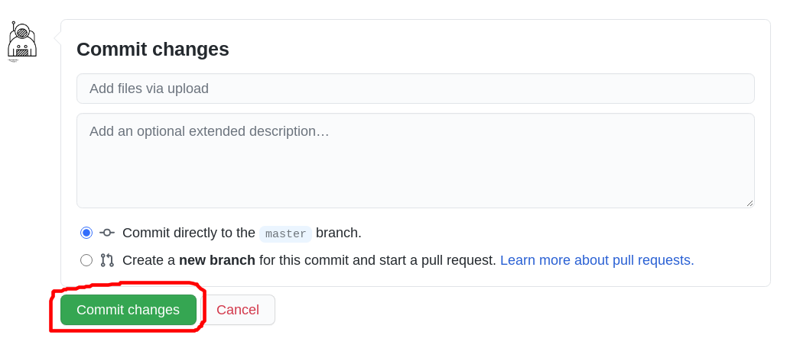
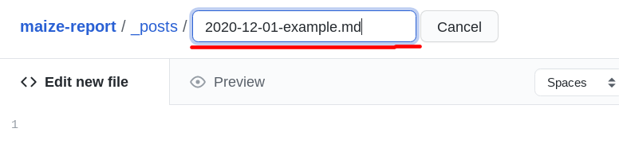
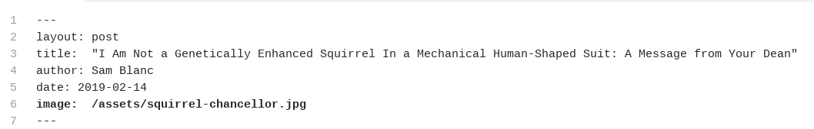

# Maize Report: How to post your own articles.

By now you've probably realized that the Maize Report is going through some website changes. 
This period of change can be strange and confusing one for authors, but we're here to help you understand what's happening with a fun choose your own adventure chosen for you.

### I am already an author with my own file in the `./_authors` directory
Congrats! You're part of the Maize Report team. A select group of people with varying tastes and interests but with one thing in common: success.
If you have an article you want to post, the first step is choosing the right image.
Once you have your image go ahead into the `./assets/` directory and click `Add File` and then upload your image:

Now give your image a super duper name!
At the bottom you can give a title to your commit so others know what's happened. 
Finally go ahead and clock "Commit changes" and watch as your image is added in with all the other great ones in this repository!

Now that you've uploaded your image, it's time to craft an article to fit the image. 
Take a 5-6 day break from this README and write a great article for the Maize Report!

When you have your article ready go over to the `./_posts` directory, go to `Add files`, and, this time, click `Create new file`.

Notice how this author did the right thing and kept a consistent naming scheme for posts. 
Looks like they're on their way to becoming a great writer. 
If you failed to pay attention, the format we're looking for is `yyyy-mm-dd-nameofthepost.md`. 
The year followed by the month followed by the date followed by the name of the file followed by a `.md`.

The first part of the article is the header which tells the website the layout of this article (it's always a `post` here),  the title of the article, the author (your full name), the date (yes, again), and the where the images is (`./assets/<the-image-file-name>`).
.

Next you can just copy and paste the article text into the file and commit the changes. 
